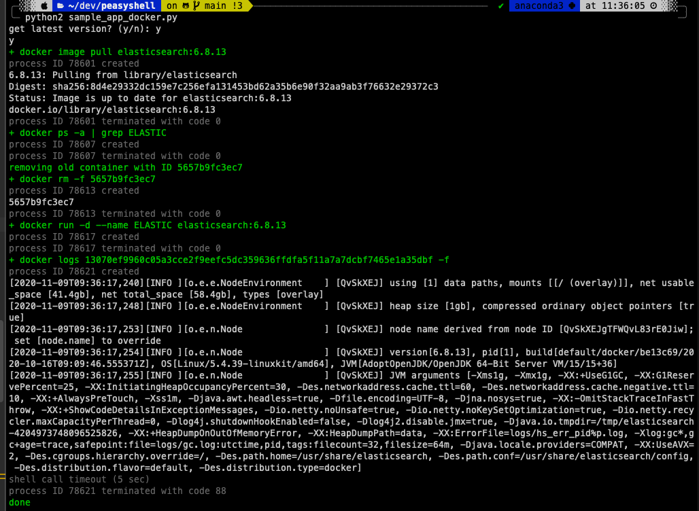

# peasyshell

Python easy shell utilities. Stop writing bash scripts and use Python instead.

Compatible with Python 2.7 and Python 3.5+.  
Tested on Mac and Ubuntu.

The story [behind it](https://davidoha.medium.com/avoiding-bash-frustration-use-python-for-shell-scripts-44bba8ba1e9e?source=friends_link&sk=a92de79cb005aa919eadaae811e3acbb).

```python
from peasyshell import *

# initialize logging to stdout in colors by severity level
init_logging()

container_name = "ES"
image_name = "elasticsearch:6.8.13"

get_latest = yes_or_no("get latest version?")
if get_latest:
    out = sh("docker image pull {}".format(image_name)).stdout

container_id = sh("docker ps -q -a -f name=^/{}$".format(container_name), capture_out=True).stdout
if container_id:
    logger.info("removing old container with ID " + container_id)
    sh("docker rm -f " + container_id)
else:
    logger.info("container does not exist")

container_id = sh("docker run -d --name {} {}".format(container_name, image_name), capture_out=True).stdout

sh("docker logs {} -f".format(container_id), timeout_sec=5)

logger.info("done")
```

Output: 



Another example [here](sample_app.py).

###How to use 

Copy [peasyshell.py](peasyshell.py) next to your Python shell script and use import it. 

### License: 
Apache-2.0

